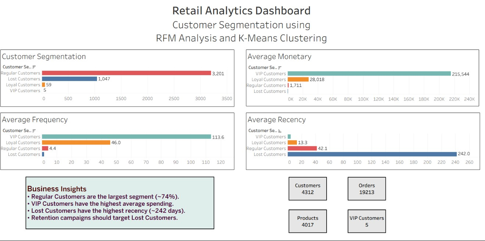

# Retail Customer Segmentation

## Overview

This project analyses retail transaction data to segment customers based on their purchasing behaviour using **RFM (Recency, Frequency, Monetary) Analysis** and **K-Means Clustering**. It includes data preprocessing, ETL, MySQL database integration, customer segmentation, and an interactive Tableau dashboard for business insights.

---

## Features

- Data cleaning and preprocessing
- ETL pipeline for structured data
- MySQL database integration
- RFM Analysis
- Customer segmentation using K-Means Clustering
- Interactive Tableau dashboard

---

## Tech Stack

- Python
- Pandas
- NumPy
- Scikit-learn
- Matplotlib
- MySQL
- SQL
- Tableau Desktop

---

## Dataset

**Online Retail II Dataset**

Source: https://archive.ics.uci.edu/ml/datasets/Online+Retail+II

---

## Project Structure

```
RetailAnalytics/
│
├── data/
│   ├── raw/
│   └── processed/
│
├── src/
│
├── sql/
│
├── dashboard/
│
├── report/
│
├── README.md
└── requirements.txt
```

---

## Workflow

1. Data Exploration
2. Data Cleaning
3. ETL Process
4. Load Data into MySQL
5. RFM Analysis
6. Customer Segmentation using K-Means
7. Tableau Dashboard

---

## Dashboard



---

## Results

- Processed over **400,000+ retail transactions**
- Segmented customers into four groups:
  - Regular Customers
  - Loyal Customers
  - VIP Customers
  - Lost Customers
- Developed an interactive Tableau dashboard to visualize customer behaviour and business insights.


---

**Sinchana M**

**PES University**
